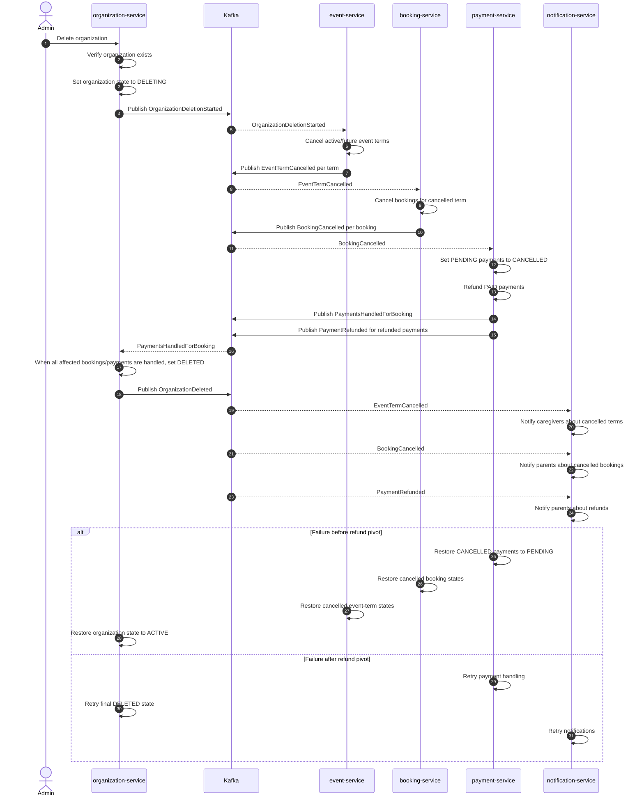

# Delete Organization Saga

## Sequence Diagram

## Transactions

| Step | Local transaction                                              | Service                | Type                        | Compensation transaction                                                |
| ---- | -------------------------------------------------------------- | ---------------------- | --------------------------- | ----------------------------------------------------------------------- |
| T0   | Validate delete request and check that the organization exists | `organization-service` | Read-only / no compensation | None                                                                    |
| T1   | Set organization state from `ACTIVE` to `DELETING`             | `organization-service` | Compensatable               | Set organization state back to `ACTIVE`                                 |
| T2   | Publish `OrganizationDeletionStarted`                          | `organization-service` | Compensatable trigger       | Publish/record deletion rejection if the saga rolls back                |
| T3   | Cancel active/future event terms for the organization          | `event-service`        | Compensatable               | Restore the previous event-term states                                  |
| T4   | Cancel bookings for the cancelled event terms                  | `booking-service`      | Compensatable               | Restore the previous booking states                                     |
| T5   | Set affected `PENDING` payments to `CANCELLED`                 | `payment-service`      | Compensatable               | Restore those payments to `PENDING`                                     |
| T6   | Refund affected `PAID` payments                                | `payment-service`      | Pivot                       | No normal compensation; after money is refunded, the saga must complete |
| T7   | Mark organization as `DELETED`                                 | `organization-service` | Retriable                   | None; retry until the final state is stored                             |
| T8   | Publish final completion events such as `OrganizationDeleted`  | owning service         | Retriable                   | None; retry until published                                             |
| T9   | Send cancellation and refund notifications                     | `notification-service` | Retriable side effect       | None; retry or dead-letter for manual handling                          |

## Findings

- The pivot is not always obvious when several irreversible or externally visible actions exist.
- A Saga is not mainly hard because of the sequence of steps, but because every step can fail, be retried, arrive twice, or arrive late.
- UIs must be designed for intermediate states, otherwise users may see confusing or inconsistent data.
- Testing a Saga is harder than testing a normal transaction because many partial-failure scenarios must be simulated.

## Questions

1. How do we decide which step should be the pivot transaction?
2. What should happen if a compensation action itself fails?
3. When is a compensation still acceptable if users may already have seen the intermediate result?
